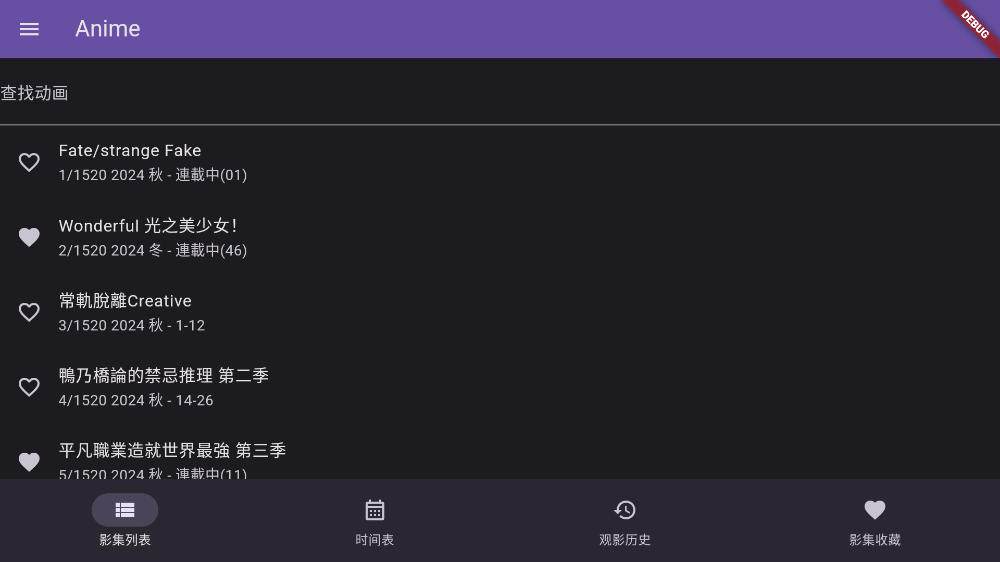
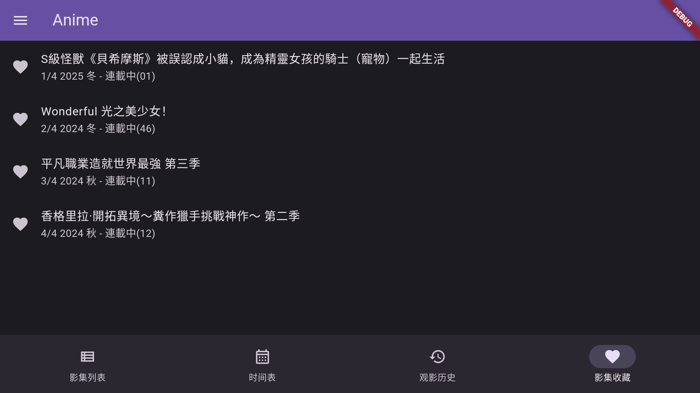
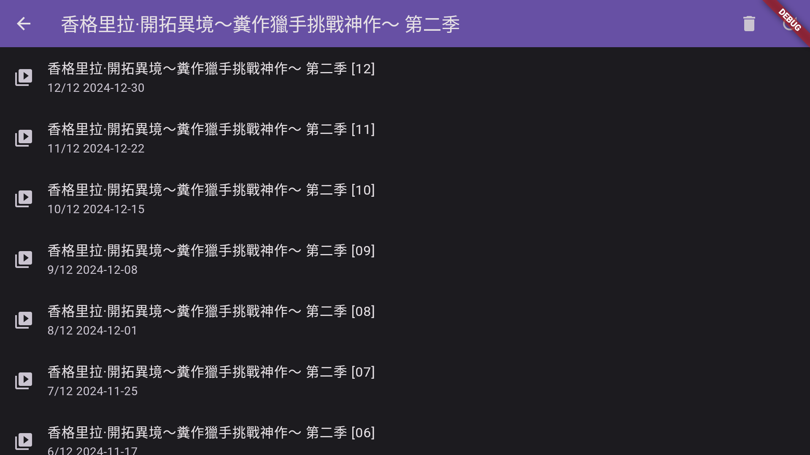
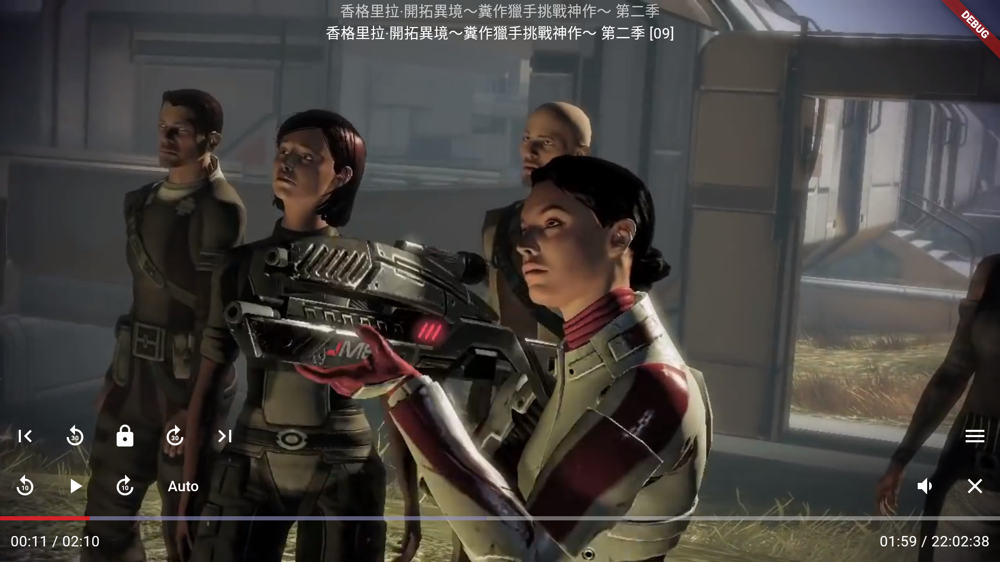

# anime

这是一个 [anime1.me](https://anime1.me/)
的第三方客户端，它免费并且没有任何烦人的广告和功能限制。包含下述特性:

1. 依据名称搜索动漫(为了方便电视用户，会将搜索关键字转为拼音和动漫名称的拼音进行匹配)
2. 收藏(你可以将喜欢的动漫加入收藏，方便快速找到)
3. 历史记录(app 会在本地记录观看进度，方便你下次继续观看)
4. 新番时间表显示每周有哪些动漫会更新
5. 影集支持多种播放模式。默认设置下当播放完当前影片后自动播放影集下一集内容

目前支持下述平台：

- android
- android tv (这是被主要支持的平台，你可以用电视遥控器舒服的躺沙发看动漫)
- windows
- linux

索引

- [背景](#背景)
- [功能预览](#功能预览)
  - [页面技巧](#页面技巧)
  - [播放器技巧](#播放器技巧)
- [下载安装包](https://github.com/selene201226/anime/releases)
- [403错误](#403错误)
- [打赏](#打赏)

# 背景

我想在沙发上躺着看 [anime1.me](https://anime1.me/)
提供的动漫，因为电视屏幕超大这样看起来才舒服，于是开发了这个 app。
独乐乐不如众乐乐所以把这个 app 发布在 github。它不会被上架到 google
store，因为上架 tv 应用太麻烦了。这个github 项目是唯一的发布渠道，
请不要从任何其它地方下载，否则有中病毒的风险。

这个项目目前没有开放源码的打算，因为我不想自己辛苦开发的 app
被人拿去修改了标题等信息后就冒充它开发的。最重要的是这个 app
目前没有开源的必要， 我认为开源主要是为了促进大家一起开发更好的 app，但这个 app
很偏个人风格，它完全是按照我的喜好进行开发的，更多人一起开发也只会让它变得混乱(和我喜好产生分歧)。

# 功能预览

> 不要纠结上图播放的内容不对，这是测试时的截图，为了方便测试，测试时都加载的一个快速的固定视频而非真实的动画视频

# 页面技巧

页面功能很简单，对于手机用户用手指去点击功能按钮或要看的内容即可，对于 tv
用户则使用遥控器将焦点移动到内容后点击遥控器确定。需要注意的是:

- 手机用户通过长按，动画列表中的动画来收藏或删除收藏。也可以使用此方式删除单个视频的观看记录
- tv
  用户通过将焦点移到到动画后，按遥控器右键来收藏或删除收藏。也可以使用此方式删除单个视频的观看记录
- 当列表很长焦点处于动画列表的动画项时，tv
  用户可以按遥控器左键将焦点设置到左上角的菜单按钮，当菜单按钮拥有焦点时可以按遥控器上键来将焦点移动到底部导航栏目

# 播放器技巧

- 手机用户通过点击屏幕打开或关闭播放器的控制器。双击屏幕实现播放或暂停影片
- tv 用户通过按遥控器上或下按钮打开控制器，按遥控器返回按钮隐藏控制器
- 对于tv用户，当控制器隐藏时，可以按遥控器确定按钮暂停或播放影片，按左右按钮来快进或快退影片

# 403错误

我偶然发现当 ip 质量很差时会触发 cloudflare 的人机验证，从而导致 app 在页面返回
403 错误，于是在 v0.0.6 版中添加了处理方案

从 v0.0.6 开始在左侧抽屉菜单中新加入了一个**HTTP
请求头**，进入可以设置发送http请求时使用的 User-Agent 和 Cookie
两个属性。有一些情况只需要修改 User-Agent
就不会再触发人机验证了，如果设置了还是不行则建议你在浏览器中打开
https://anime1.me 并通过人机验证后，将浏览器此时的 User-Agent 和 Cookie 值拷贝到
app 中。(如果浏览器中打开没有进行人机验证，通常你只需要拷贝 User-Agent 的值即可)

> cloudflare 会依据多种情况判断是否需要进行人机验证，最主要的因素就是
> IP，其次还会依据 User-Agent 来识别浏览器。故最有效的方法是修改
> IP(但这有时可能无法做到)，此时尝试修改 User-Agent
> 可能也可以避免触发人机验证，故建议多修改几个 User-Agent 测试看看。 当修改了
> User-Agent 还是无效则只能去进行人机验证，当验证通过后 Cloudfalre 会记录一个
> Cookie 表示已经通过不需要再进行人机验证了故此时将 User-Agent 和 Cookie
> 一起拷贝到 app 中即可解决问题。但一旦 Cookie 过期下次使用时或许会再次出现 403
> 错误，此时需要重新进行人机验证后将最新的 Cookie 拷贝到 app 中

抽屉菜单中还有个 Webview 按钮，对于桌面系统它会调用浏览器打开
[https://anime1.me](https://anime1.me) ，对于非桌面系统则内置了一个 webview
组件直接在 app 内打开 [https://anime1.me](https://anime1.me)。当内置组件加载完
[https://anime1.me](https://anime1.me)
后你可以点击页面右上角的同步按钮，它会自动将此时的 User-Agent 和 Cookie 设置到
app 内，用以避免调用 anime1.me 网页时触发人机验证

# 打赏

这个项目没有任何直接的盈利，没有任何广告和任何买断花费。任何人都可以免费使用所有的功能。

如你所见，开发者也是需要吃饭的生物。如果你有能力也觉得这个项目不错，不妨请我喝杯咖啡，这会极大的提高本小姐对这个项目的热情，这对
bug 修复和功能优化或许会有帮助。
但是即使你不这样做，也可以完整并且没有任何干扰的使用这个
app，毕竟我们都有相同的爱好那就是动漫！

请使用微信扫码进行打赏\

请使用支付宝扫码进行打赏\

