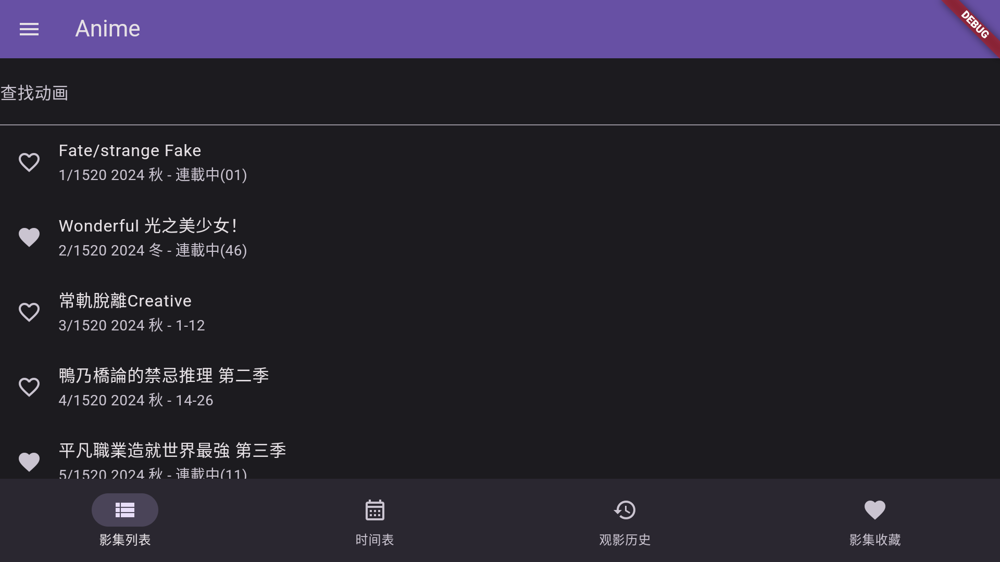
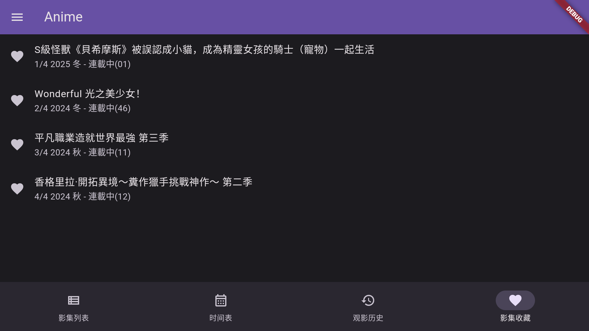
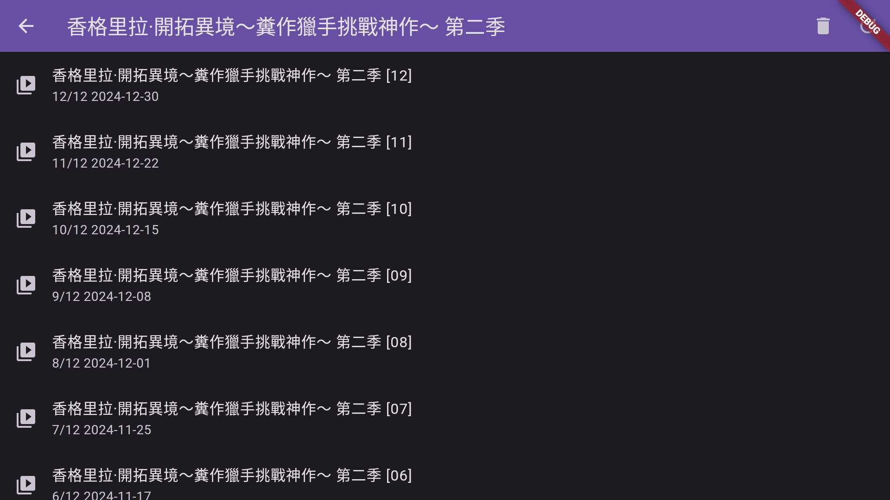
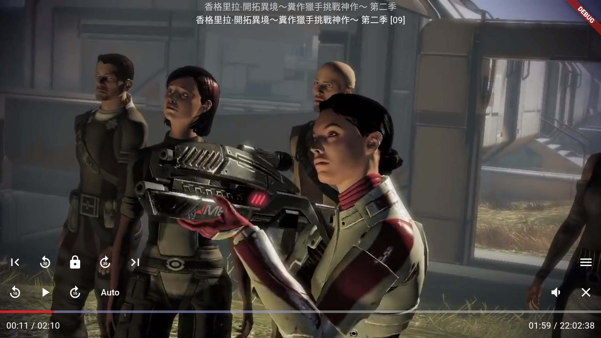
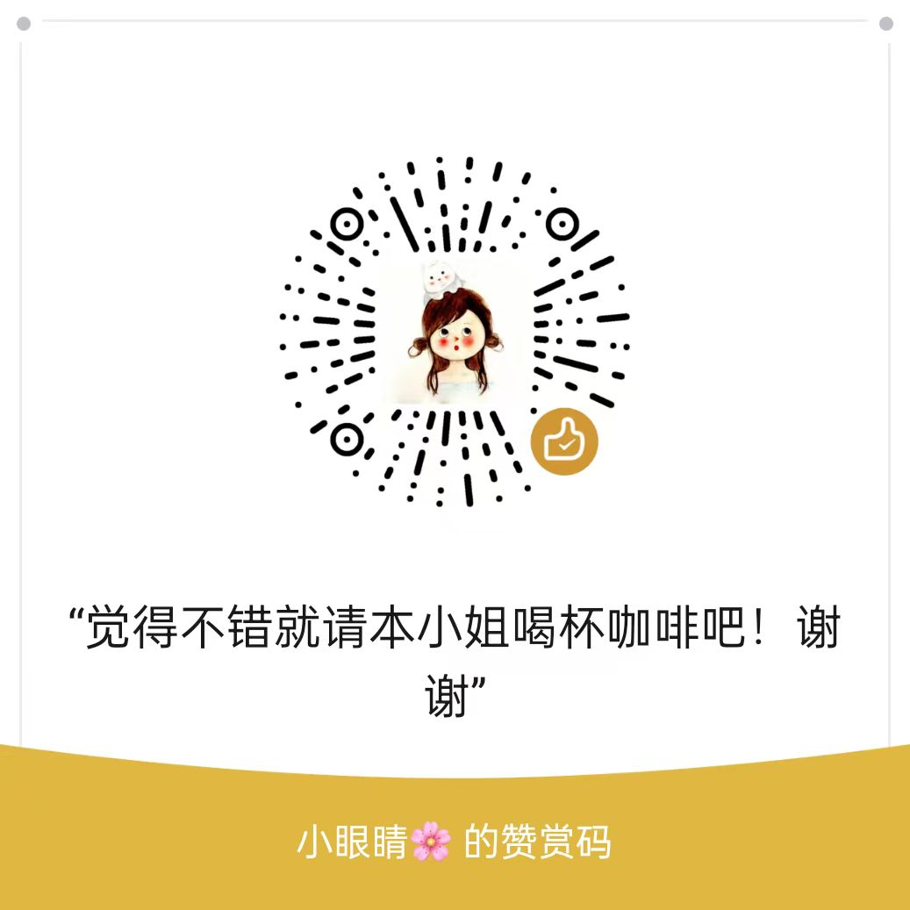

# 📺 Anime1 第三方客户端 (Android / TV / Desktop)

这是一个专为 [anime1.me](https://anime1.me/) 打造的第三方客户端。 **完全免费、无广告、无功能限制**。特别针对电视 (Android TV) 遥控器操作进行了深度优化，让你轻松躺在沙发上追番。

---

## ✨ 核心特性

* 🔍 **智慧搜索**：支持拼音搜索，电视用户输入关键字超方便。
* ❤️ **个人收藏**：快速储存心爱的动漫，不再大海捞针。
* 📜 **历史记录**：自动储存观看进度，上次看到哪，点开继续看。
* 📅 **新番时间表**：掌握每周更新动态，不再错过最新集数。
* 🎬 **流畅播放**：支持多种播放模式，默认自动播放下一集。

## 🖥️ 支持平台

| 平台 | 说明 |
| :--- | :--- |
| **Android / TV** | **主要支持平台**，优化遥控器操作，适合大屏幕。 |
| **Windows** | 桌面端流畅体验。 |
| **Linux** | 支持各类发行版。 |

---

## 📥 下载与安装

请务必只从本 GitHub 项目的 **[Releases 页面](https://github.com/selene201226/anime/releases)** 下载安装包。

> [!CAUTION]
> 本项目不打算上架 Google Store 或其他应用商店。请勿从任何第三方来源下载，以防病毒或木马风险。

---

## 📸 功能预览

---

## ⌨️ 操作技巧

### 📱 手机用户
* **收藏/删除**：长按列表中的动画项。
* **播放器**：点击屏幕切换控制栏，双击播放/暂停。

### 📺 电视 (TV) 用户
* **收藏/删除**：焦点移至动画，按遥控器 **[右键]**。
* **导航小技巧**：在列表左侧按 **[左键]** 可快速跳回选单。
* **播放控制**：隐藏控制栏时，按 **[确定键]** 暂停，**[左右键]** 快进/快退。

---

## 🛠️ 疑难排解：403 错误 (Cloudflare 验证)

如果 App 出现 403 错误，通常是因为 IP 被 Cloudflare 要求人机验证。

**推荐解法 (v0.0.6+)：**
1. 打开侧栏选单的 **Webview**。
2. 在 App 内完成 anime1.me 的人机验证。
3. 点击右上角的 **同步按钮**，App 会自动更新 User-Agent 与 Cookie。

---

## 📝 关于项目

### 为什么不开源？
我不希望辛苦开发的作品被他人随意修改标题后冒充发布。此外，这是一个极具「个人风格」的 App，完全按照我的喜好开发，为了保持设计逻辑的纯粹，目前暂不考虑开源或接受共同开发。

---

## ☕ 打赏

本项目没有任何盈利，完全凭借对动漫的热爱。如果你觉得好用，欢迎请我喝杯咖啡，这会极大提高本小姐修复 Bug 与优化功能的动力！

点击展开打赏码

 

 微信支付

 支付宝

---
*本 App 与 anime1.me 官方无关，仅供交流学习使用。 *
